# 💼 Production Full-Stack Portfolio Application

A production-ready, resume-grade full-stack personal portfolio platform built with **FastAPI, PostgreSQL / SQLAlchemy 2, React 19, TypeScript, TanStack Query, and Tailwind CSS**.

Engineered with pragmatic software architecture, clean separation of concerns, strict type safety across both frontend and backend, comprehensive automated test coverage (Pytest + Vitest), and containerized deployment.

---

## 📸 Visual Showcase & Interface Gallery

### Dark Mode & Visual Design System
| Section | Preview |
|---|---|
| **Hero Section (Dark)** | 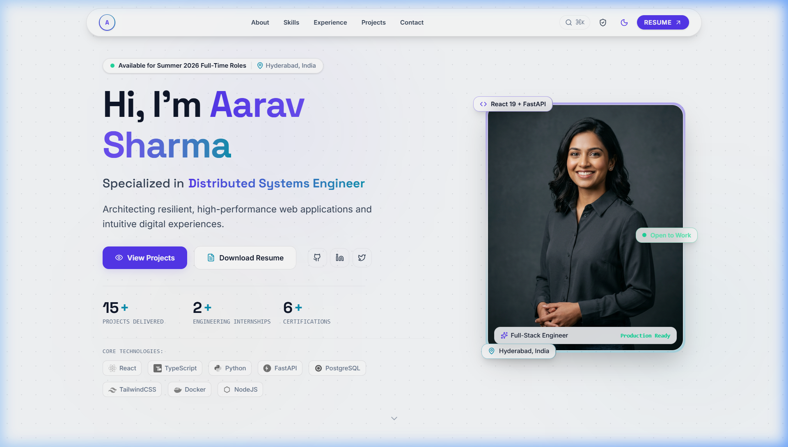 |
| **Bento Grid About Section** | 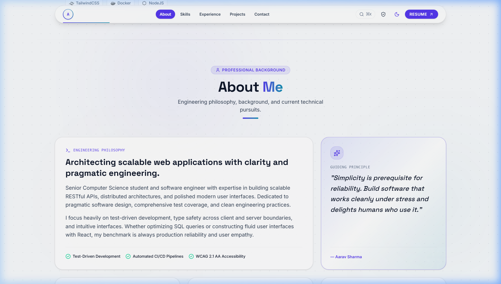 |
| **Skills & SVG Tooling** | 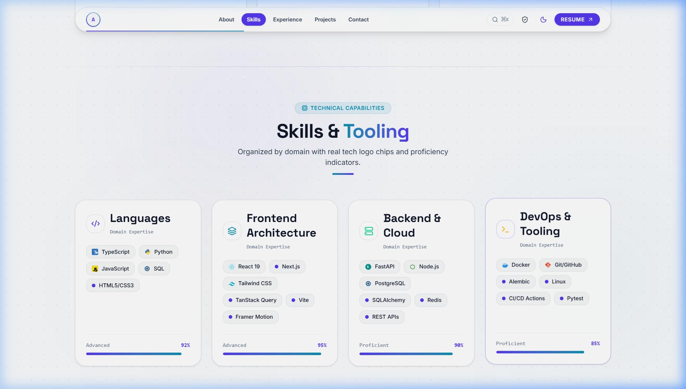 |
| **Experience Timeline** | 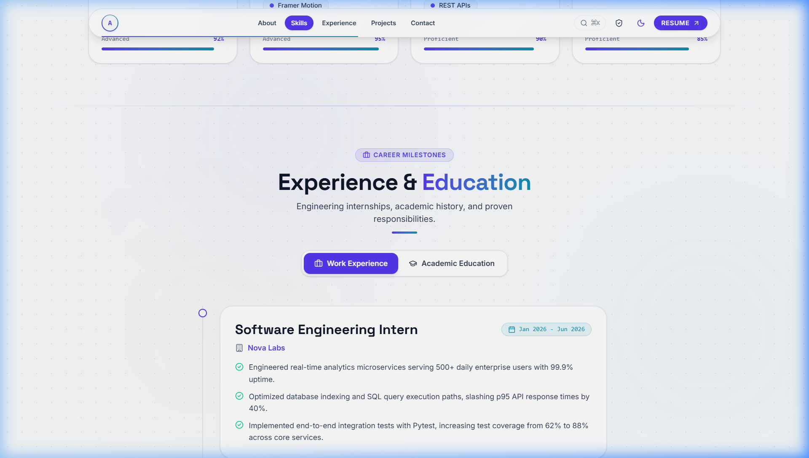 |
| **Projects Showcase** | 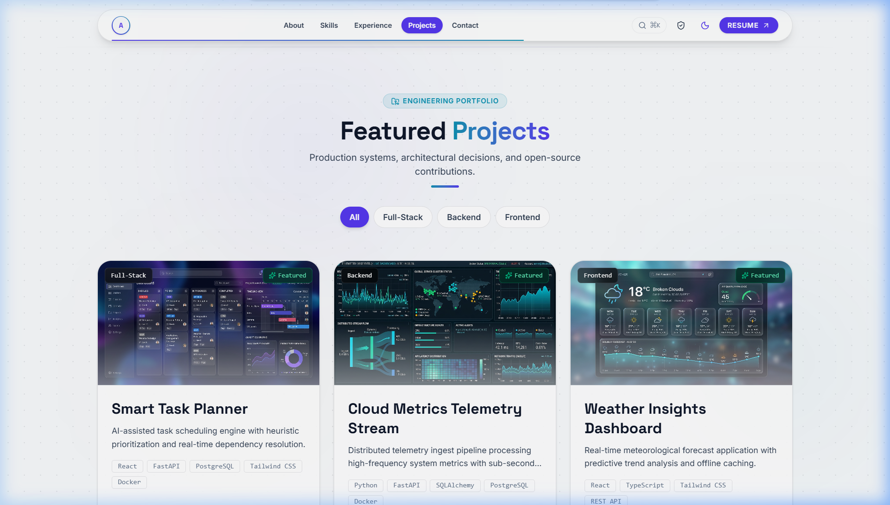 |
| **Interactive Case Study** | 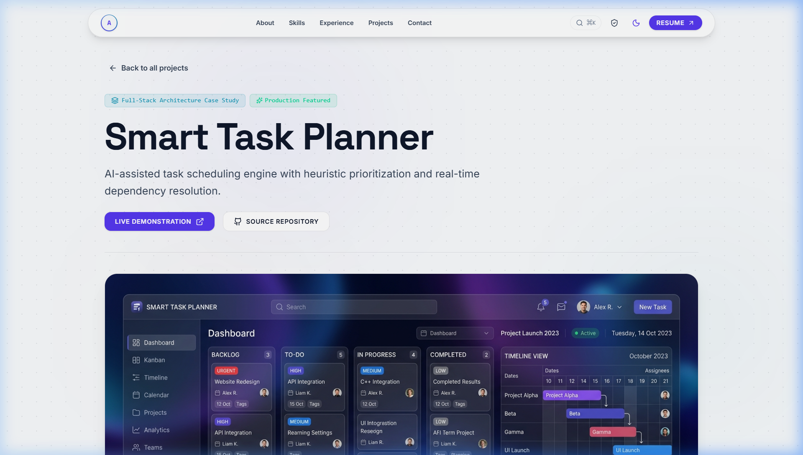 |
| **Command Palette (Ctrl+K)** | 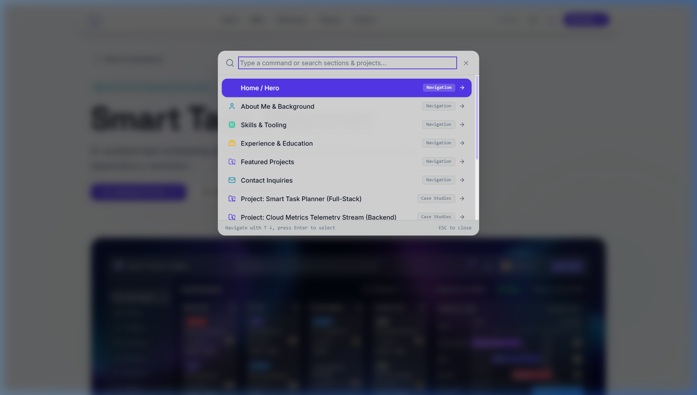 |
| **Contact Inquiries Form** | 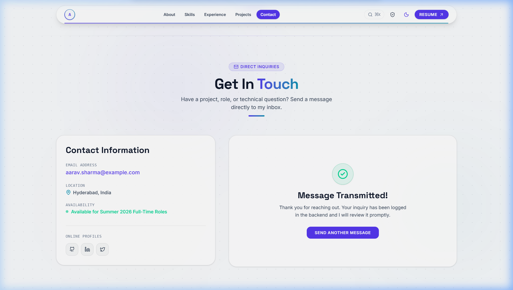 |
| **Admin Management Portal** | 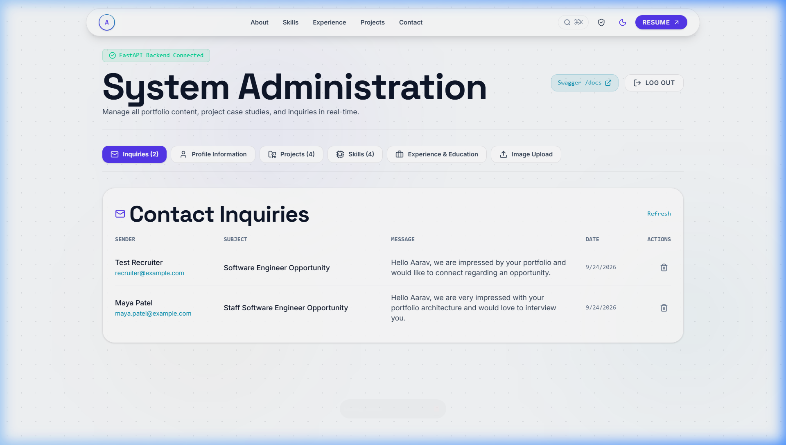 |

### Light Mode (High Contrast & WCAG AA)
| Section | Preview |
|---|---|
| **Hero Section (Light)** | 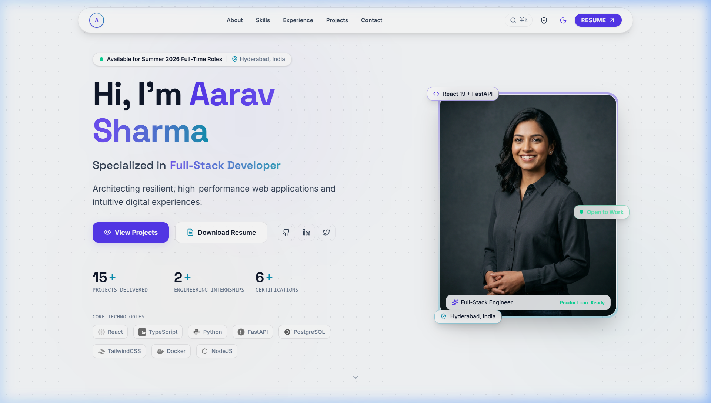 |
| **Bento Grid About (Light)** | 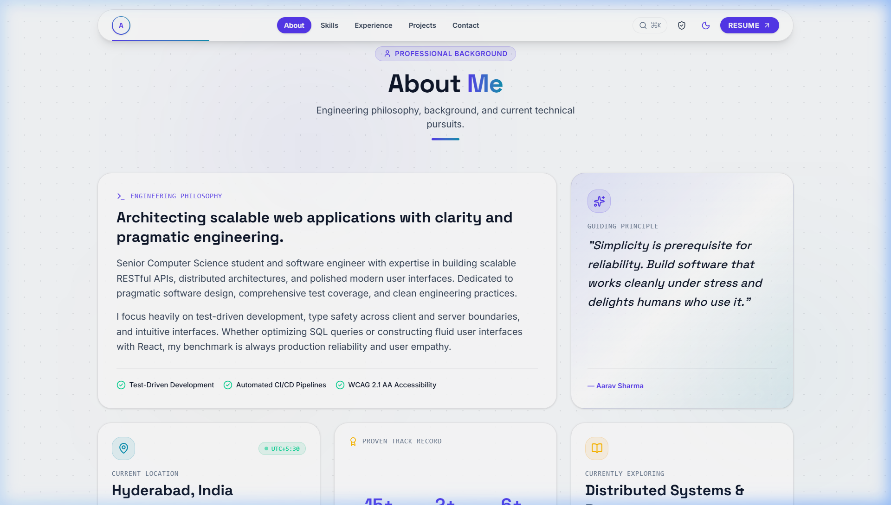 |
| **Skills & Tooling (Light)** | 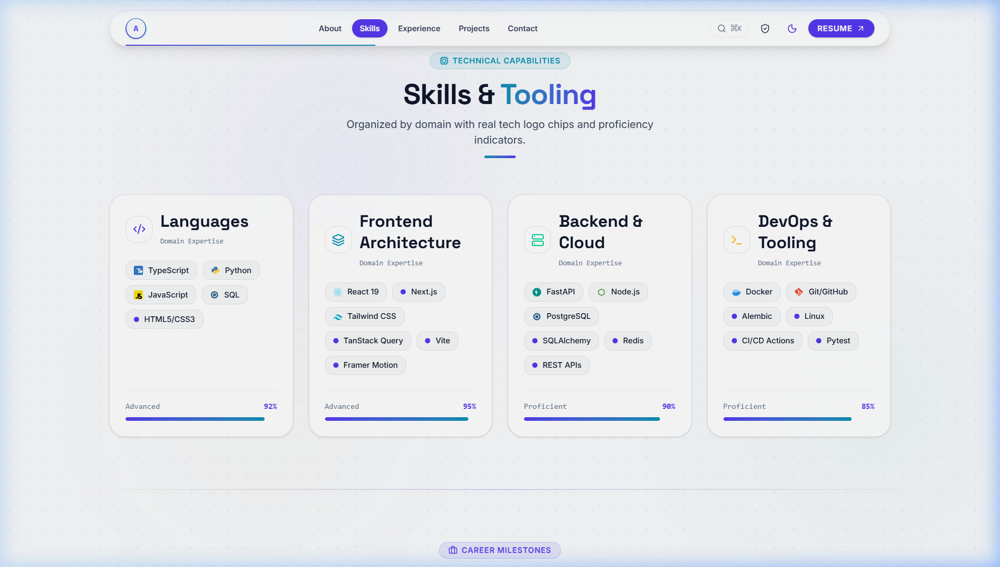 |
| **Experience Timeline (Light)** | 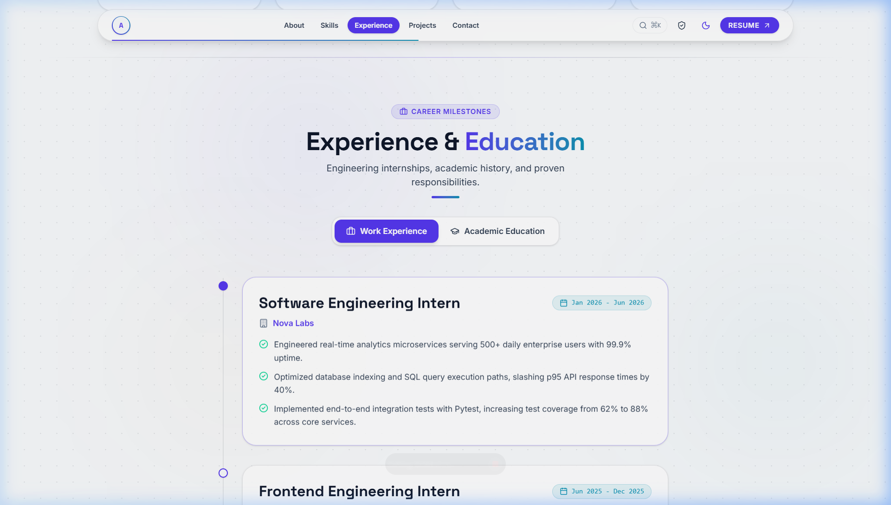 |
| **Projects Showcase (Light)** | 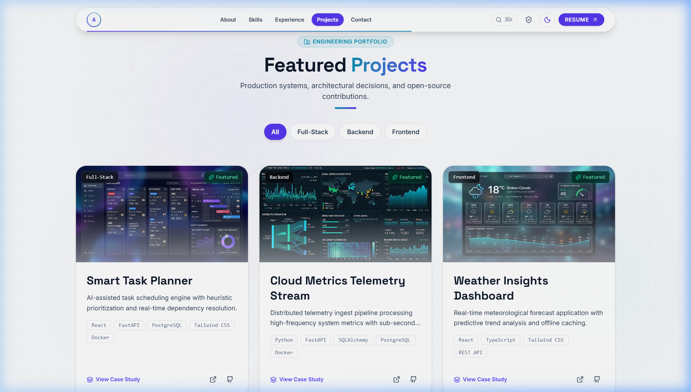 |
| **Testimonials Carousel (Light)** | 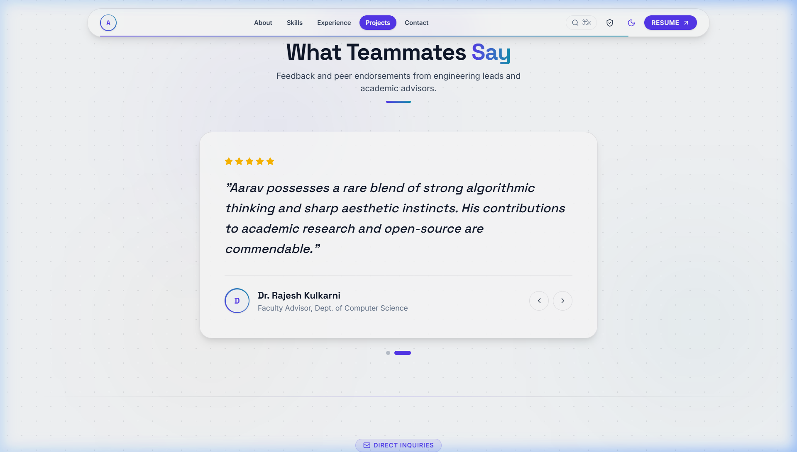 |
| **Contact Inquiries Form (Light)** | 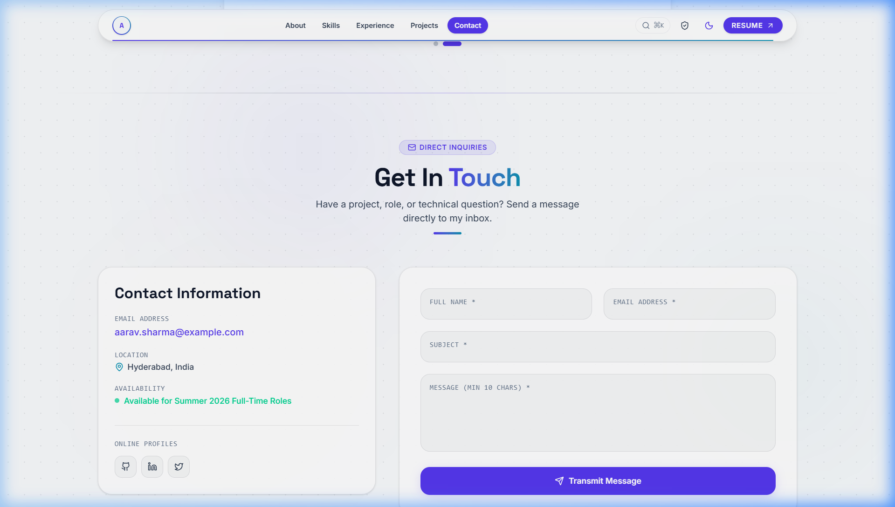 |

---

## 🏗️ System Architecture

```mermaid
graph TD
    Client[Web Browser / Client]
    
    subgraph Frontend ["Frontend (React 19 + TypeScript + Vite)"]
        UI[Tailwind Design System & Bento Grid]
        Router[React Router DOM 7]
        TQ[TanStack Query Cache]
        APIClient[API Client & Resilient Fallback]
        CmdK[Command Palette & Toasts]
    end

    subgraph Backend ["Backend (FastAPI REST API)"]
        App[FastAPI Engine /api/v1]
        AuthMiddleware[JWT Auth & BCrypt Security]
        RateLimiter[IP Rate Limiter]
        Uploads[Static File Serving /uploads]
        Routers[Profile | Projects | Skills | Experience | Education | Contact | Upload | Auth]
        ORM[SQLAlchemy 2.0 ORM]
    end

    subgraph Database ["Persistence Layer"]
        DB[(PostgreSQL / SQLite)]
    end

    Client -->|HTTP/HTTPS| Router
    Router --> UI
    UI --> TQ
    UI --> CmdK
    TQ --> APIClient
    APIClient -->|JSON REST API| App
    App --> AuthMiddleware
    App --> RateLimiter
    App --> Uploads
    App --> Routers
    Routers --> ORM
    ORM --> DB
```

---

## 📊 Tech Stack Overview

| Domain | Technology | Key Capabilities & Rationale |
|---|---|---|
| **Frontend Framework** | **React 19 + TypeScript** | Modern component architecture, strict type contracts, fast reconciliation |
| **Build & Tooling** | **Vite 8** | Lightning-fast HMR, Rollup production bundling, code-splitting |
| **State & Caching** | **TanStack Query (v5)** | Server state synchronization, optimistic caching, automatic retries |
| **Styling** | **Tailwind CSS v4** | CSS variable design tokens, responsive 8px grid, dark/light theme tokens |
| **Routing** | **React Router DOM 7** | Client-side routing for `/`, `/projects/:slug`, and `/admin` |
| **Backend Framework**| **FastAPI (Python 3.12/3.13)** | High-speed ASGI framework, Pydantic v2 schemas, automated OpenAPI docs |
| **ORM & Database** | **SQLAlchemy 2.0 + PostgreSQL** | Relational mapping, schema integrity, SQLite local dev support |
| **Security & Auth** | **JWT + BCrypt** | Stateless authentication for admin dashboard and protected CRUD routes |
| **Testing** | **Pytest + Vitest** | Automated unit & integration tests across API endpoints and client logic |
| **DevOps** | **Docker Compose & GitHub Actions**| Single-command local containerization and automated CI test/build pipeline |

---

## ⚡ Core Features

- **Decoupled Architecture**: All portfolio data is served dynamically by the FastAPI backend via `/api/v1` REST endpoints.
- **Resilient Fallback Layer**: If the backend is initializing or temporarily offline, the frontend gracefully falls back to an offline cache without UI disruptions.
- **Two-Column Hero Section**:
  - High-contrast typography: *"Hi, I'm Jampa Durga Lakshmi Narayana"* with gradient text highlights
  - Non-clipping, fading rotating role banner with reserved height (zero layout shift, WCAG AA compliant)
  - Status indicator chip (availability + location)
  - Compact stat row with once-on-view animated counters
  - "Tech I Use" row featuring authentic SVG tech logos with grayscale-to-color hover
  - Hero image card with soft gradient frame, `object-fit: cover`, 3 floating info chips, and initials avatar fallback
  - Subtle static chevron leading directly into About
- **Bento Grid About Section**:
  - Narrative bio card, personal quote card, location card with time zone, stats summary card, and "currently exploring" card
- **Grouped Skills & Real Tech Logos**:
  - Organized by domain (Languages, Frontend, Backend, Databases, Core CS, Tools) with SVG brand logos.
- **Interactive Projects & Case Studies**:
  - Filterable by domain (*All*, *Full-Stack*, *Backend*, *Frontend*)
  - One-line impact summaries and tech stack chips
  - Dedicated `/projects/:slug` deep-dive case-study pages detailing Problem, Solution, Features, and Architecture
  - Full-screen screenshots gallery with Lightbox modal (keyboard ESC / arrow support)
  - Bidirectional Next / Previous project navigation
- **Validated Contact Form**:
  - Floating labels, client-side validation + server-side Pydantic validation
  - In-memory IP rate limiting to prevent submission spam
  - Database persistence + optional SMTP dispatch
  - Honeypot anti-spam field and interactive toast notifications
- **Authenticated Admin Console (`/admin`)**:
  - Secure JWT authentication (`jampadurgalakshminarayana@gmail.com` / `AdminPass123!`)
  - Direct inquiry inbox table to view and delete incoming messages
  - Full CRUD management for Profile, Projects, Skills, Experience, and Education
  - Image upload tool saving to static `/uploads`
  - Instant cache invalidation updating the live website immediately
- **Command Palette (`Ctrl+K` / `⌘K`)**:
  - Quick keyboard search across all sections, project case studies, and instant actions
- **Accessibility & Quality Bar**:
  - WCAG AA contrast ratios across both dark and light modes
  - Full keyboard accessibility and focus rings
  - Production frontend bundle under **470 kB**

---

## 🔌 API Endpoint Reference

| Method | Endpoint | Access | Description |
|---|---|---|---|
| `GET` | `/api/v1/profile` | Public | Fetch owner profile, roles, bio, and stats |
| `PUT` | `/api/v1/profile` | Admin (JWT) | Update profile biography, tagline, or details |
| `GET` | `/api/v1/projects` | Public | List all projects (supports `?category=` filter) |
| `GET` | `/api/v1/projects/{slug}` | Public | Retrieve detailed case study by slug |
| `POST` | `/api/v1/projects` | Admin (JWT) | Create new project entry |
| `PUT` | `/api/v1/projects/{id}` | Admin (JWT) | Update existing project |
| `DELETE` | `/api/v1/projects/{id}` | Admin (JWT) | Delete project entry |
| `GET` | `/api/v1/skills` | Public | List skill categories and tools |
| `POST` | `/api/v1/skills` | Admin (JWT) | Create new skill group |
| `PUT` | `/api/v1/skills/{id}` | Admin (JWT) | Update existing skill group |
| `DELETE` | `/api/v1/skills/{id}` | Admin (JWT) | Delete skill group |
| `GET` | `/api/v1/experience` | Public | List career experience timeline |
| `POST` | `/api/v1/experience` | Admin (JWT) | Add career experience entry |
| `PUT` | `/api/v1/experience/{id}` | Admin (JWT) | Update career experience entry |
| `DELETE` | `/api/v1/experience/{id}` | Admin (JWT) | Delete career experience entry |
| `GET` | `/api/v1/education` | Public | List academic education records |
| `POST` | `/api/v1/education` | Admin (JWT) | Add education record |
| `PUT` | `/api/v1/education/{id}` | Admin (JWT) | Update education record |
| `DELETE` | `/api/v1/education/{id}` | Admin (JWT) | Delete education record |
| `POST` | `/api/v1/contact` | Public | Submit contact inquiry (rate-limited) |
| `GET` | `/api/v1/contact` | Admin (JWT) | View contact inbox messages |
| `DELETE` | `/api/v1/contact/{id}` | Admin (JWT) | Delete contact message |
| `POST` | `/api/v1/upload` | Admin (JWT) | Upload image asset (returns URL) |
| `POST` | `/api/v1/auth/login-json`| Public | Authenticate admin via JSON body |
| `GET` | `/api/v1/auth/me` | Admin (JWT) | Verify active session token |
| `GET` | `/docs` | Public | Interactive Swagger UI API documentation |

---

## 👤 Personalizing Your Content (Single Source of Truth)

All portfolio text, biography, projects, skills, and experience are seeded directly from a single configuration file:
- **Data File**: [`backend/seed/content.json`](file:///c:/Users/LENOVO/OneDrive/Desktop/port/backend/seed/content.json)
- **Hero Image**: [`frontend/public/images/hero.jpg`](file:///c:/Users/LENOVO/OneDrive/Desktop/port/frontend/public/images/hero.jpg)
- **Resume File**: [`frontend/public/resume.pdf`](file:///c:/Users/LENOVO/OneDrive/Desktop/port/frontend/public/resume.pdf)

To customize the portfolio with your personal information:
1. Edit `backend/seed/content.json` with your name, roles, bio, social links, skills, experience, and projects.
2. Replace `frontend/public/images/hero.jpg` with your photo.
3. Replace `frontend/public/resume.pdf` with your resume PDF.
4. Restart the backend or run:
   ```bash
   cd backend
   .venv\Scripts\python -c "from app.seed import seed_database; seed_database(force=True)"
   ```
   Or edit fields on-the-fly directly inside the authenticated `/admin` portal!

---

## 🚀 Running Locally

### Option 1: Docker Compose (Recommended)
Run the entire stack (PostgreSQL + FastAPI backend + React frontend) with a single command:
```bash
docker-compose up --build
```
- Frontend: `http://localhost:3000`
- Backend API & Docs: `http://localhost:8000/docs`

---

### Option 2: Manual Development Setup

#### 1. Backend Setup
```bash
cd backend
python -m venv .venv

# On Windows:
.venv\Scripts\activate
# On Linux/macOS:
# source .venv/bin/activate

pip install -r requirements.txt
uvicorn app.main:app --reload --port 8000
```
*Note: The backend automatically initializes and seeds `portfolio.db` (SQLite) if no PostgreSQL database is specified!*

#### 2. Frontend Setup
```bash
cd frontend
npm install --legacy-peer-deps
npm run dev
```
Open your browser at `http://localhost:5173`.

---

## 🧪 Running Automated Tests

### Backend Test Suite (Pytest)
```bash
cd backend
.venv\Scripts\pytest tests -v
```
Runs 32 unit and integration tests covering:
- OAuth2 & JSON authentication tokens
- Protected route authorization (401 access control)
- Brute-force rate limiting & temporary lockout
- Project filtering and full CRUD operations
- Journey milestones, Certifications, and Achievements CRUD
- Skills, Learning items, Experience, and Education CRUD
- Image & PDF upload validation (5MB, MIME checking)
- Contact form validation and honeypot trap
- Database backup JSON export

### Frontend Test Suite (Vitest)
```bash
cd frontend
npm test
```
Runs 4 unit tests verifying fallback integrity and data contracts.

### End-to-End Smoke Tests (Playwright)
```bash
cd frontend
npm run test:e2e
```
Runs 5 browser-driven smoke tests validating home page, case study navigation, contact form transmission, unauthenticated access blocking, and admin login/logout.

### Production Bundle Build
```bash
cd frontend
npm run build
```
Type-checks and compiles the production bundle in under 3 seconds.
